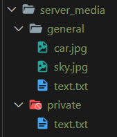
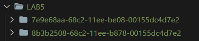
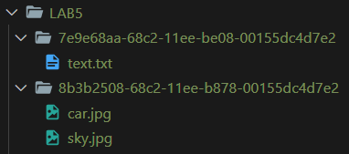

# LAB5

## Class Task

Presented during the previous lab.

The only extra thing done is proper formating of messages in the terminal. See `client.py` and `server.py`.

```
Enter message type (or 'exit' to quit):
connect
Enter room name: general
Enter your name: alice
Connected to the 'general' room.
```

When testing, if `Enter message type...` does not appear in console, press Enter to make it reappear again.

## Homework

### File upload

- Command: `upload: <path to file>`
- Implementation code: `handle_upload` in `client.py`, and `handle_upload_request` in `server.py`
- Functionality:

  - Checks if the file exists at the provided path, if not raises an error. Only client observes this error;

        ```
        Enter message type (or 'exit' to quit):
        upload
        Enter relative path to file: test/abracadabra.txt
        File abracadabra.txt does not exist!
        ```

  - If it exists, it's uploaded to the server. Other members of the room are acknowledged about upload event;

        ```
        User alice uploaded sky.jpg file.
        ```

  - All files are saved in a `server_media` directory on the server, organized uniquely by room.

    

    - During the upload process, the file (whether it's a `txt` or an image) is transformed into bytes, segmented into chunks each of `BUFFER_SIZE` length, and transmitted to the server. Initially, the file's size is dispatched, followed by the sequential transmission of all chunks. The following logic is implemented both in server (download request) and client (upload);

      ```python
      data = json.dumps(message_json).encode('utf-8')
      data_length = len(data)
      client_socket.send(data_length.to_bytes(BUFFER_SIZE, byteorder='big'))
      client_socket.send(json.dumps(message_json).encode('utf-8'))
      ```

    - The receiver of byte chunks reasembles them back and saves in created file buffer.

      ```python
      length_header = client_socket.recv(BUFFER_SIZE)
      if not length_header:
          return None
      message_length = int.from_bytes(length_header, byteorder='big')

      full_data = b""

      while len(full_data) < message_length:
          data = client_socket.recv(BUFFER_SIZE)
          full_data += data

      return json.loads(full_data.decode('utf-8'))
      ```

### File download

- Command: `download: <name of file.extension>`
- Implementation code: `handle_download` in `client.py`, and `handle_download_request` in `server.py`
- Functionality:

  - When the client is initiated, a unique client folder is created for downloaded files;

    

  - Checks if the file exists in the `server_media` directory under the respective room;

        ```
        Enter message type (or 'exit' to quit):
        download
        Enter name of file to download: eryuy.ee
        The 'eryuy.ee' does not exist!
        ```

  - If everything is OK, the client downloads requested file in his unique media folder.

    

For test purposes, you can use files from `test` folder.
