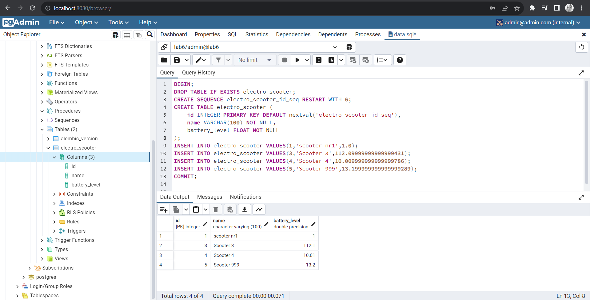

# LAB6

## Class Task

Run `python3 app.py` and access http://localhost:5000/apidocs/ for displaying Swagger UI.

## Homework

The task was to migrate Flask app form SQLite to PostgreSQL. In order to accomplish this, I performed the following steps:

1. Initializing Migration Environment `flask db init`:

   It creates a new `migrations` folder which will contain all the migration scripts.

2. Generating Migration Script `flask db migrate -m "init migration"`:

   This command auto-generates a migration script based on the differences between the current state of the app's models (as defined in Flask) and the current state of the database. The generated script will be saved in the `migrations/versions` directory.

3. Applying Migration `flask db upgrade`:

   This command applies the migration, effectively updating the PostgreSQL database schema to match the app's models.

4. Exporting SQLite Data `sqlite3 instance/your_database.db .dump > data.sql`:

   This command exports the entire SQLite database into a SQL dump file named `data.sql`. This file contains SQL commands that, when executed, will recreate the database and its data.

5. Modifying the SQL Dump for PostgreSQL:

   Adjusting the creational script according to the PostgreSQL standards.

   ```sql
    BEGIN;
    DROP TABLE IF EXISTS electro_scooter;
    CREATE SEQUENCE electro_scooter_id_seq RESTART WITH 6;
    CREATE TABLE electro_scooter (
        id INTEGER PRIMARY KEY DEFAULT nextval('electro_scooter_id_seq'),
        name VARCHAR(100) NOT NULL,
        battery_level FLOAT NOT NULL
    );
    INSERT INTO electro_scooter VALUES(1,'scooter nr1',1.0);
    INSERT INTO electro_scooter VALUES(3,'Scooter 3',112.09999999999999431);
    INSERT INTO electro_scooter VALUES(4,'Scooter 4',10.009999999999999786);
    INSERT INTO electro_scooter VALUES(5,'Scooter 999',13.199999999999999289);
    COMMIT;
   ```

6. Import into PostgreSQL:

   The last steps - running `data.sql` inside PostgreSQL environment and checking the data integrity.

   

In this homework I worked with dockerized `postgres` and `pgadmin` instances.
Create `.env` and `docker.env` files for storing secrets used in database setup.

Example of `.env` file:

```
POSTGRES_HOST=localhost
POSTGRES_PORT=5432
POSTGRES_USER=admin
POSTGRES_PASSWORD=admin
POSTGRES_DB=lab6
```

Example of `docker.env` file:

```
POSTGRES_USER=admin
POSTGRES_PASSWORD=admin
POSTGRES_DB=lab6
PGADMIN_DEFAULT_EMAIL=admin@admin.com
PGADMIN_DEFAULT_PASSWORD=admin
```

Before starting the app, run `docker-compose up`. For using pgadmin, access http://localhost:8080/.
