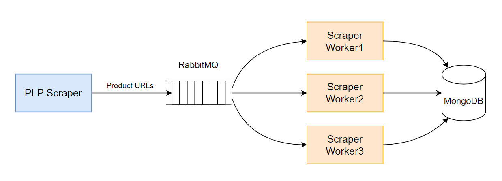

# LAB7

## Integration of RabbitMQ into a Web-Crawler

### System Architecture



The architecture is composed of a Producer, which is a Product Listing Page (PLP) scraper, and an array of Consumers, referred to as Product Page Scrapers (or Scraper Workers). The Producer's role is to scrap URLs for all products and enqueue them. Each Worker, operating in its own thread, retrieves a single URL from the queue, scraps all pertinent information about the specific product, and then records this data into a unified MongoDB instance. This design allows for the simultaneous instantiation and management of multiple Workers, thanks to the allocation of individual threads for each.

This system deals only with cars product pages from 999.md.

An example of a product URL: `https://999.md/ro/84784012`.

The scrapped data is stored as an array of objects in a MongoDB collection:

```json
[
  {
    "_id": {
      "$oid": "65478cc3b1149558a36ad9a7"
    },
    "product_name": "Mazda CX-5",
    "content_description": "Credit / Leasing / Scimb\n\nProcurarea...",
    "seller_id": "SarguTransAuto",
    "price": {
      "amount": "32000",
      "currency": "€"
    },
    "region": {
      "country": "Moldova",
      "locality": "Chisinau mun."
    },
    "tel": "+37369609999",
    "general": {
      "tip oferta": "Vand",
      "marca": "Mazda",
      "modelul": "CX-5",
      "inmatriculare": "Republica Moldova",
      "stare": "Cu rulaj"
    },
    "safety": [
      "sistem de antiblocare a franelor (abs)",
      "airbaguri perdea",
      "sistem antiderapare (tcs, asr, trc)"
    ],
    "feature": {
      "autorul anuntului": "Dealer auto",
      "anul fabricatiei": "2020",
      "volan": "Stanga",
      "numarul de locuri": "5"
    },
    "comfort": [
      "clima automata",
      "servodirectie",
      "volan reglabil pe inaltime"
    ]
  },
  {
    "_id": {
      "$oid": "65478cc4b1149558a36ad9a9"
    },
    "product_name": "Toyota Avensis",
    "content_description": "",
    "seller_id": "bonjour8275",
    "price": {
      "amount": "12300",
      "currency": "€"
    },
    "region": {
      "country": "Moldova",
      "locality": "Hincesti"
    },
    ...
  },
  ...
]
```

All recorded documents can be view by running `playground.mongodb.js`.

### Running the project

#### Docker

In this project I worked with dockerized version of RabbitMQ and MongoDB.
Create `.env` and `rabbitmq.env` files for storing secrets used in database setup and RabbitMQ server setup correspondingly.

Example of `.env` file:

```
MONGO_USERNAME=username
MONGO_PASSWORD=super_secret_password
MONGO_DATABASE=lab7
MONGO_HOST=localhost:27017
```

Example of `rabbitmq.env` file:

```
RABBITMQ_DEFAULT_USER=username
RABBITMQ_DEFAULT_PASS=super_secure_password
```

Before starting the app, run `docker-compose up`. For using RabbitMQ admin panel, access http://localhost:15672/#/.

#### Running Producer and Workers

Create and activate virtual enviroment:

```
python -m venv venv
source venv/bin/activate
```

Running the Producer script: `python plp_scraper.py`. You can modify the maximum number of pages to be parsed by setting the `nr_pages` variable.

Running the Worker script: `python scraper_worker.py`. The number of threads can be modified in `num_threads` variable from `main`.
